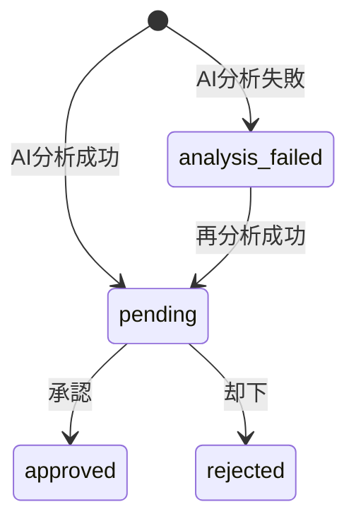

# Unified Spec-Writer Skill – v1.0

> **Scope**: 仕様書作成・更新・Spec-First原則に特化

---

## 0. Identity

**name:** `spec-writer`
**version:** 1.0
**related:** なし（単独使用）

---

## 1. Core Principles

### 1.1 Source of Truth

- The specification IS the system
- Code newer than spec = **BUG** → update spec first

### 1.2 Specification-First

- **No implementation without specification**
- Change = modify `01_Overview` (What/Why) + `02_Technical` (How)
- Execute only after human approval

### 1.3 Reverse Feedback Loop

- Implementation/testing insights → assetize back into spec
- Boundary conditions → `02_Technical` exception tables

---

## 2. Interface Decision Protocol (Mandatory)

### 2.1 AI proposes, NEVER decides

For every API endpoint / exported function:

| Pattern | Use Case |
|---------|----------|
| **ACTION** | `{success, message, data?}` - 状態変更、Toast通知 |
| **DTO** | Full structured object/array - データ取得 |
| **PAGINATED** | `{data, total, page, limit}` - 一覧取得 |

### 2.2 Process

1. AI explains recommended policy + rationale
2. AI asks: **"Should we proceed with this return format?"**
3. After human confirmation → record in `02_Technical`

### 2.3 Never

- Auto-decide interfaces
- Drift from agreed format

---

## 3. Clarity & Precision Rules

### 3.1 Explicit Subject

```markdown
### [API] GET /api/articles
### [Component] ArticleCard
### [Hook] useArticles
```

### 3.2 Mermaid Diagrams (Mandatory)

**状態遷移、データフロー、シーケンス図は必ずMermaid形式で記述する**

| 図の種類 | Mermaid Type | 用途 |
|----------|--------------|------|
| 状態遷移 | `stateDiagram-v2` | ステータス変更フロー |
| データフロー | `flowchart TD` | 処理の流れ、分岐 |
| シーケンス | `sequenceDiagram` | API呼び出し、コンポーネント間通信 |
| ER図 | `erDiagram` | テーブル関係 |

**例: 状態遷移図**



**ASCII art は使用禁止** - 視認性とツール連携のためMermaidを使用すること

### 3.3 TypeScript Specificity

Explicit types: `interface`, `type`, Zod schemas

---

## 4. File Structure

| File | Content |
|------|---------|
| `Feature_01_Overview.md` | Goals, actors, constraints, global flow |
| `Feature_02_Technical.md` | API signatures, interface decisions, data flows |
| `Feature_03_Appendix.md` | Unresolved items, decisions log |

**Location**: `Documentation/Specifications/`

---

## 5. Activation & Operations

**Trigger**: 仕様書ファイル（`*.md`）の作成・更新時

### Operational Protocol

1. **Spec Verification**: Search existing spec, identify gaps
2. **Proposal**: Propose as spec edits (not code)
   - Interface return policy
   - Data-flow diagram
   - Logic steps (3-5)
3. **Synchronized Execution**:
   - Update spec → Generate code

---

## 6. Always / Never

**Always**:

- Update spec before code
- Human-approved return format
- Subject clarity, Data-flow first
- Compact logic (3-5 steps)

**Never**:

- Auto-decide interfaces
- Write TODO inside spec (→ TASKS.md)

---

## 7. Completion Report

```text
✅ Spec-Writer v1.0 Applied

Spec Updates:
- Feature_02_Technical.md (Added: [API] GET /api/articles)

Interface Agreement:
- Policy: ACTION / DTO / PAGINATED
- Final Return Format: { ... }

Front-loading:
- Data Flow: Provided
- Interface: Proposed → Approved
```

---

## 8. Version History

**v1.0 (2026-01-31)**: 初版作成（Next.js/TypeScript向け）
