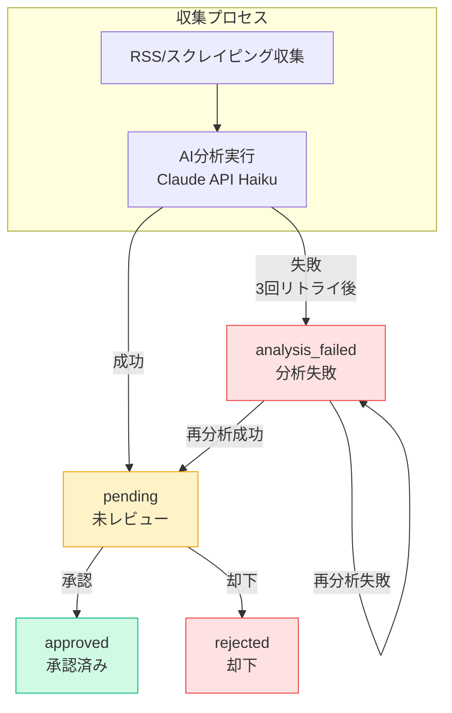
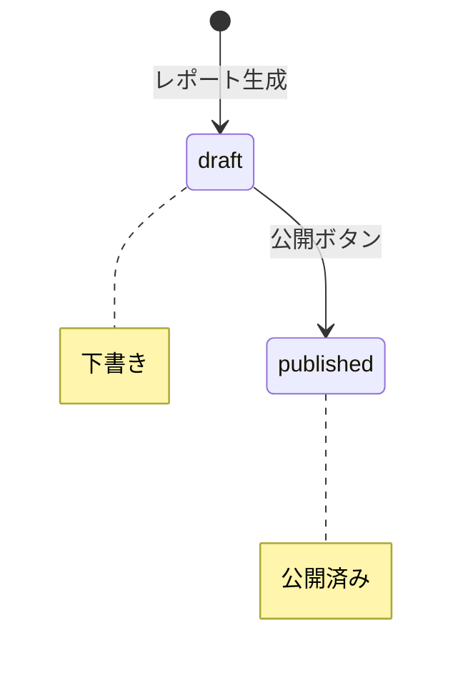
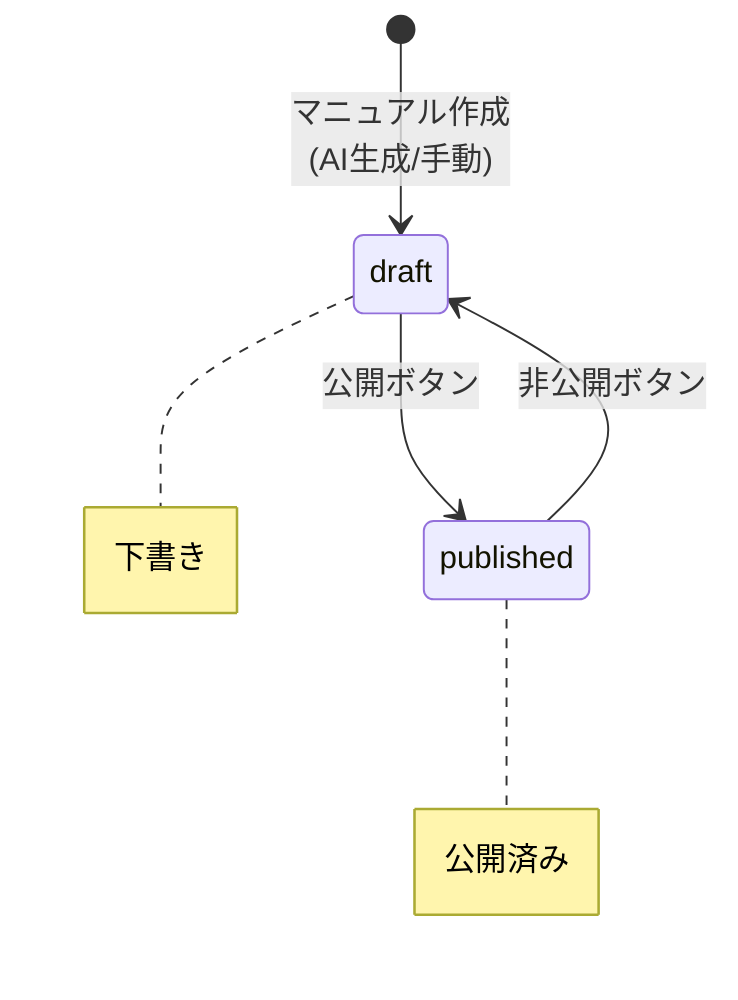

# AI Coding Knowledge Hub - 状態遷移仕様書

**バージョン**: 1.1
**作成日**: 2026-02-01
**更新日**: 2026-02-01
**関連**: [PRD_02_Technical.md](PRD_02_Technical.md), [PRD_04_Features.md](PRD_04_Features.md)

---

## 1. 概要

本仕様書では、システム内の各エンティティ（記事、レポート、マニュアル）のステータス遷移を定義する。

---

## 2. 記事（articles）の状態遷移

### 2.1 状態定義

| 状態 | 値 | 説明 | UI表示 |
|------|-----|------|--------|
| 未レビュー | `pending` | AI分析完了、人間レビュー待ち | 黄色バッジ「未レビュー」 |
| 承認済み | `approved` | 人間がレポート掲載を承認 | 緑色バッジ「承認済み」 |
| 却下 | `rejected` | 人間がレポート掲載を却下 | 赤色バッジ「却下」 |
| 分析失敗 | `analysis_failed` | AI分析が失敗（リトライ対象） | 赤色バッジ「分析失敗」 |

### 2.2 状態遷移図

```mermaid
stateDiagram-v2
    [*] --> 収集: RSS/スクレイピング

    state 収集 {
        [*] --> AI分析
    }

    AI分析 --> pending : 分析成功
    AI分析 --> analysis_failed : 分析失敗<br>(3回リトライ後)

    state pending {
        direction LR
    }
    note right of pending : 未レビュー

    state analysis_failed {
        direction LR
    }
    note right of analysis_failed : 分析失敗

    pending --> approved : 承認ボタン
    pending --> rejected : 却下ボタン
    analysis_failed --> pending : 再分析成功
    analysis_failed --> analysis_failed : 再分析失敗

    state approved {
        direction LR
    }
    note right of approved : 承認済み<br>(終了状態)

    state rejected {
        direction LR
    }
    note right of rejected : 却下<br>(終了状態)
```

### 2.2.1 シンプル版状態遷移図



### 2.3 遷移ルール

| # | 開始状態 | 終了状態 | トリガー | 条件 | 処理 |
|---|----------|----------|----------|------|------|
| T-01 | (新規) | pending | AI分析成功 | 分析結果が有効なJSON | スコア・要約・タグを保存、ai_analyzed_at記録 |
| T-02 | (新規) | analysis_failed | AI分析失敗 | 3回リトライ後も失敗 | ai_error にエラーメッセージ保存 |
| T-03 | pending | approved | 承認ボタン押下 | なし | reviewed_at記録、human_*スコア保存 |
| T-04 | pending | rejected | 却下ボタン押下 | なし | reviewed_at記録、human_*スコア保存 |
| T-05 | analysis_failed | pending | 再分析成功 | 分析結果が有効なJSON | スコア・要約・タグを保存、ai_error=null |
| T-06 | analysis_failed | analysis_failed | 再分析失敗 | 再分析も失敗 | ai_errorを更新 |
| T-07 | approved | pending | ― | 禁止（逆戻り不可） | ― |
| T-08 | rejected | pending | ― | 禁止（逆戻り不可） | ― |

> **注意**: 一度承認/却下した記事のステータスは変更不可。誤操作時は管理者がDBを直接修正する想定（Phase 2で取り消し機能を検討）。

### 2.4 状態別の利用可能アクション

| 状態 | 表示 | レビュー | 再分析 | 削除 | レポート対象 |
|------|------|---------|--------|------|-------------|
| pending | ✅ | ✅ | ❌ | ✅ | ❌ |
| approved | ✅ | ❌（閲覧のみ） | ❌ | ✅ | ✅ |
| rejected | ✅ | ❌（閲覧のみ） | ❌ | ✅ | ❌ |
| analysis_failed | ✅ | ❌ | ✅ | ✅ | ❌ |

### 2.5 DB更新仕様

#### T-01: AI分析成功時

```sql
UPDATE articles
SET
  status = 'pending',
  ai_importance = :importance,
  ai_usefulness = :usefulness,
  ai_difficulty = :difficulty,
  ai_reason = :reason,  -- JSONB
  ai_tags = :tags,      -- TEXT[]
  summary = :summary,
  ai_analyzed_at = now(),
  ai_error = NULL,
  updated_at = now()
WHERE id = :id;
```

#### T-02: AI分析失敗時

```sql
UPDATE articles
SET
  status = 'analysis_failed',
  ai_error = :errorMessage,
  updated_at = now()
WHERE id = :id;
```

#### T-03/T-04: レビュー保存時

```sql
UPDATE articles
SET
  status = :status,  -- 'approved' or 'rejected'
  human_importance = :humanImportance,
  human_usefulness = :humanUsefulness,
  human_difficulty = :humanDifficulty,
  human_comment = :humanComment,
  reviewed_at = now(),
  updated_at = now()
WHERE id = :id AND status = 'pending';  -- pending以外は更新不可
```

#### T-05: 再分析成功時

```sql
UPDATE articles
SET
  status = 'pending',
  ai_importance = :importance,
  ai_usefulness = :usefulness,
  ai_difficulty = :difficulty,
  ai_reason = :reason,
  ai_tags = :tags,
  summary = :summary,
  ai_analyzed_at = now(),
  ai_error = NULL,
  updated_at = now()
WHERE id = :id AND status = 'analysis_failed';  -- analysis_failed以外は再分析不可
```

---

## 3. レポート（reports）の状態遷移

### 3.1 状態定義

| 状態 | 値 | 説明 | UI表示 |
|------|-----|------|--------|
| 下書き | `draft` | 生成済み、未公開 | グレーバッジ「下書き」 |
| 公開 | `published` | 公開済み | 緑色バッジ「公開済み」 |

### 3.2 状態遷移図



### 3.3 遷移ルール

| # | 開始状態 | 終了状態 | トリガー | 条件 | 処理 |
|---|----------|----------|----------|------|------|
| R-01 | (新規) | draft | レポート生成 | 対象記事数 > 0 | レポート内容をMarkdownで保存 |
| R-02 | draft | published | 公開ボタン | なし | status更新 |

> **注意**: MVP では公開/非公開の切り替えは想定しない。

### 3.4 状態別の利用可能アクション

| 状態 | 表示 | エクスポート | 削除 |
|------|------|-------------|------|
| draft | ✅ | ✅ | ✅ |
| published | ✅ | ✅ | ✅ |

---

## 4. マニュアル（manuals）の状態遷移（Phase 2）

### 4.1 状態定義

| 状態 | 値 | 説明 | UI表示 |
|------|-----|------|--------|
| 下書き | `draft` | 編集中、非公開 | グレーバッジ「下書き」 |
| 公開 | `published` | 公開済み | 緑色バッジ「公開済み」 |

### 4.2 状態遷移図



### 4.3 遷移ルール

| # | 開始状態 | 終了状態 | トリガー | 条件 | 処理 |
|---|----------|----------|----------|------|------|
| M-01 | (新規) | draft | マニュアル作成 | なし | 初期コンテンツ保存 |
| M-02 | draft | published | 公開ボタン | なし | status更新 |
| M-03 | published | draft | 非公開ボタン | なし | status更新 |

### 4.4 状態別の利用可能アクション

| 状態 | 表示 | 編集 | 削除 |
|------|------|------|------|
| draft | ✅ | ✅ | ✅ |
| published | ✅ | ✅ | ✅ |

---

## 5. ソース（sources）の有効/無効状態

### 5.1 状態定義

| 状態 | 値 | 説明 | 収集対象 |
|------|-----|------|---------|
| 有効 | `is_active = true` | 定期収集の対象 | ✅ |
| 無効 | `is_active = false` | 定期収集の対象外 | ❌ |

### 5.2 遷移ルール

| # | 開始状態 | 終了状態 | トリガー |
|---|----------|----------|----------|
| S-01 | (新規) | 有効 | ソース追加（デフォルト） |
| S-02 | 有効 | 無効 | トグルスイッチOFF |
| S-03 | 無効 | 有効 | トグルスイッチON |

### 5.3 DB更新仕様

```sql
UPDATE sources
SET
  is_active = :isActive,
  updated_at = now()
WHERE id = :id;
```

---

## 6. 状態遷移のAPI対応

### 6.1 記事ステータス変更

| API | 遷移 | リクエスト例 |
|-----|------|-------------|
| `PUT /api/articles/[id]/review` | pending → approved/rejected | `{ "status": "approved", "humanImportance": 4, ... }` |
| `POST /api/articles/[id]/reanalyze` | analysis_failed → pending/analysis_failed | (なし) |

### 6.2 レスポンスフォーマット

```typescript
// 成功時
{
  success: true,
  message: "記事を承認しました",
  data: {
    id: "xxx",
    status: "approved",
    updatedAt: "2026-02-01T12:00:00Z"
  }
}

// 失敗時（不正な遷移）
{
  success: false,
  message: "この記事はレビューできません",
  error: {
    code: "INVALID_STATE_TRANSITION",
    details: "現在のステータス: approved"
  }
}
```

---

## 7. エラーケースと対処

### 7.1 記事の状態遷移エラー

| エラーケース | 原因 | HTTP Status | エラーコード | 対処 |
|-------------|------|-------------|-------------|------|
| 無効な遷移 | 承認済み記事を再レビュー | 400 | INVALID_STATE_TRANSITION | UIでボタン非活性化 |
| 記事が見つからない | 削除済み/存在しないID | 404 | ARTICLE_NOT_FOUND | UIでエラー表示 |
| AI再分析失敗 | API障害 | 500 | AI_ANALYSIS_ERROR | リトライボタン表示 |
| 同時編集 | 他ユーザーが先に更新 | 409 | CONFLICT | リロード促す |

### 7.2 バリデーションルール

```typescript
// レビュー時のバリデーション
const validateReview = (current: ArticleStatus, action: 'approve' | 'reject') => {
  if (current !== 'pending') {
    throw new InvalidStateTransitionError(
      `Cannot ${action} article with status: ${current}`
    );
  }
};

// 再分析時のバリデーション
const validateReanalyze = (current: ArticleStatus) => {
  if (current !== 'analysis_failed') {
    throw new InvalidStateTransitionError(
      `Cannot reanalyze article with status: ${current}`
    );
  }
};
```

---

## 8. UI表示仕様

### 8.1 ステータスバッジ

| 状態 | バッジクラス | テキスト |
|------|-------------|---------|
| pending | `bg-yellow-100 text-yellow-800` | 未レビュー |
| approved | `bg-green-100 text-green-800` | 承認済み |
| rejected | `bg-red-100 text-red-800` | 却下 |
| analysis_failed | `bg-red-100 text-red-800` | 分析失敗 |
| draft | `bg-gray-100 text-gray-800` | 下書き |
| published | `bg-green-100 text-green-800` | 公開済み |

### 8.2 状態別ボタン表示

```tsx
// 記事詳細画面のボタン表示ロジック
const renderActions = (status: ArticleStatus) => {
  switch (status) {
    case 'pending':
      return (
        <>
          <Button onClick={handleReject}>却下</Button>
          <Button variant="primary" onClick={handleApprove}>承認</Button>
        </>
      );
    case 'analysis_failed':
      return (
        <Button variant="danger" onClick={handleReanalyze}>再分析</Button>
      );
    case 'approved':
    case 'rejected':
      return (
        <span className="text-gray-500">レビュー済み</span>
      );
  }
};
```

---

## 9. 承認履歴

| 日付 | バージョン | 内容 |
|------|-----------|------|
| 2026-02-01 | 1.0 | 初版作成 |
| 2026-02-01 | 1.1 | 状態遷移図をMermaid形式に変換 |
