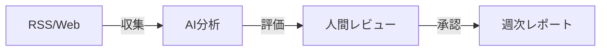

# AI Knowledge Hub

AIコーディング情報を収集・分析・管理するナレッジハブシステム

## 概要

技術ブログやドキュメントサイトから最新のAIコーディング情報を自動収集し、Claude AIで分析・評価。人間がレビューして承認した情報を週次レポートにまとめます。



## 機能

| カテゴリ | 機能 |
|---------|------|
| 情報収集 | RSS収集、スクレイピング、重複検出 |
| AI分析 | 重要度・有用度・難易度の自動評価、要約生成、タグ付与 |
| レビュー | 記事一覧、詳細表示、人間評価、承認/却下 |
| レポート | 週次レポート自動生成、エクスポート |

## 技術スタック

| レイヤー | 技術 |
|---------|------|
| Frontend | Next.js 14 (App Router), React, Tailwind CSS |
| Backend | Next.js API Routes |
| Database | Supabase (PostgreSQL) |
| AI | Claude API (Haiku) |
| Hosting | Vercel |

## セットアップ

### 必要なもの

- Node.js 20+
- Supabaseアカウント
- Anthropic APIキー

### インストール

```bash
# 依存パッケージのインストール
npm install

# 環境変数の設定
cp .env.example .env.local
# .env.local を編集してAPIキーを設定

# 開発サーバー起動
npm run dev
```

### 環境変数

```env
NEXT_PUBLIC_SUPABASE_URL=your-supabase-url
NEXT_PUBLIC_SUPABASE_ANON_KEY=your-supabase-anon-key
SUPABASE_SERVICE_ROLE_KEY=your-service-role-key
ANTHROPIC_API_KEY=your-anthropic-api-key
```

## ドキュメント

| ドキュメント | 説明 |
|-------------|------|
| [PRD_01_Overview](Documentation/Specifications/PRD_01_Overview.md) | 製品要件定義 |
| [PRD_02_Technical](Documentation/Specifications/PRD_02_Technical.md) | 技術仕様 |
| [PRD_03_UI_Specification](Documentation/Specifications/PRD_03_UI_Specification.md) | UI仕様 |
| [PRD_04_Features](Documentation/Specifications/PRD_04_Features.md) | 機能一覧 |
| [PRD_05_State_Transitions](Documentation/Specifications/PRD_05_State_Transitions.md) | 状態遷移 |
| [MVP_Implementation_Tasks](Documentation/MVP_Implementation_Tasks.md) | 実装タスク |

## 画面構成

| 画面 | パス | 説明 |
|------|------|------|
| ダッシュボード | `/` | 統計サマリー、最近の記事 |
| 記事一覧 | `/articles` | 記事の検索・フィルター |
| 記事詳細 | `/articles/[id]` | 記事内容・レビュー入力 |
| ソース管理 | `/sources` | 監視対象サイトの管理 |
| レポート | `/reports` | 週次レポートの閲覧・生成 |

## 開発状況

**フェーズ**: 実装開始準備完了

- [x] 要件定義
- [x] 技術仕様策定
- [x] UI設計・モックアップ
- [ ] Phase 0: 環境構築
- [ ] Phase 1: 基盤実装
- [ ] Phase 2: 収集機能
- [ ] Phase 3: AI分析機能
- [ ] Phase 4: UI実装
- [ ] Phase 5: 統合・テスト

## ライセンス

Private
